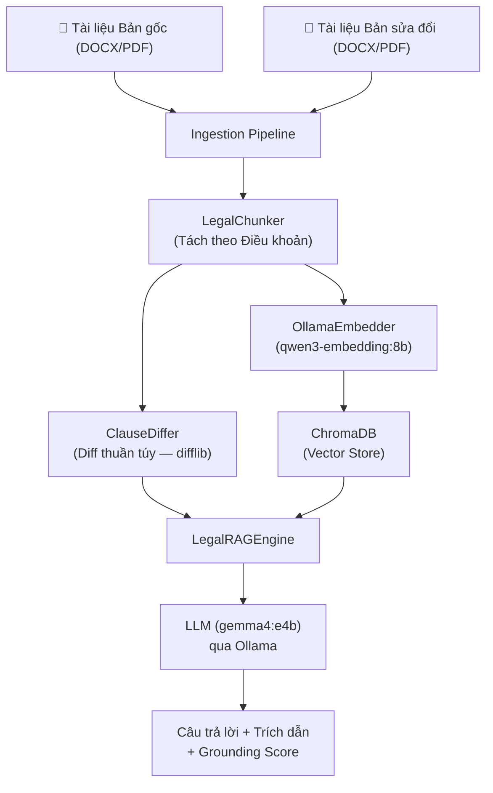

# ReRag — Trợ Lý So Sánh Hợp Đồng Pháp Lý Chạy Cục Bộ

> Hệ thống hỗ trợ phát hiện khác biệt giữa hai phiên bản hợp đồng/phụ lục tiếng Việt, kết hợp **Thuật toán Diff thuần túy** và **RAG (Retrieval-Augmented Generation)** với **LLM chạy hoàn toàn offline** — không gửi dữ liệu ra ngoài.

---

## Mục lục

1. [Kiến trúc hệ thống](#kiến-trúc-hệ-thống)
2. [Yêu cầu cài đặt](#yêu-cầu-cài-đặt)
3. [Hướng dẫn chạy](#hướng-dẫn-chạy)
4. [Kết quả đánh giá](#kết-quả-đánh-giá)
5. [Cấu trúc thư mục](#cấu-trúc-thư-mục)
6. [Giới hạn & Lưu ý](#giới-hạn--lưu-ý)

---

## Kiến trúc hệ thống



### Cách tiếp cận: Hybrid Diff + RAG

Hệ thống sử dụng **hai lớp phát hiện thay đổi** độc lập:

| Lớp | Phương pháp | Vai trò |
|---|---|---|
| **Tầng 1** | ClauseDiffer (difflib) | So sánh tất cả Điều khoản theo từng dòng, phát hiện mọi thay đổi |
| **Tầng 2** | RAG + LLM | Trả lời câu hỏi ngữ nghĩa, giải thích và trình bày thay đổi |

Khi nhận câu hỏi tổng quát ("liệt kê tất cả thay đổi"), hệ thống ưu tiên kết quả Diff — đảm bảo **không bỏ sót** thay đổi nhỏ (số liệu, ngày tháng, tên riêng) mà LLM có thể hallucinate.

---

## Yêu cầu cài đặt

### 1. Cài Ollama và pull model

```bash
# Cài Ollama: https://ollama.com/download

# Pull model LLM (dùng để sinh câu trả lời)
ollama pull gemma4:e4b

# Pull model Embedding (dùng để vector hóa văn bản)
ollama pull qwen3-embedding:8b
```

### 2. Cài Python dependencies

```bash
# Khuyến nghị dùng virtual environment
python -m venv .venv
.venv\Scripts\activate       # Windows
# source .venv/bin/activate  # Linux/macOS

pip install -r requirements.txt
```

**Nội dung `requirements.txt`:**
```
python-docx>=1.1.0
pdfplumber>=0.11.0
PyMuPDF>=1.24.0
pytest>=8.0.0
streamlit>=1.30.0
chromadb>=0.5.0
ollama>=0.3.0
```

---

## Hướng dẫn chạy

### Chạy ứng dụng web

```bash
# Đảm bảo Ollama đang chạy trước
ollama serve

# Chạy Streamlit app
streamlit run app.py
```

Sau đó mở trình duyệt tại `http://localhost:8501`.

**Luồng sử dụng:**
1. Tải lên **Bản gốc** (file DOCX/PDF/TXT)
2. Tải lên **Bản sửa đổi**
3. Nhấn **"Khởi tạo Hệ thống RAG"** — hệ thống tự động:
   - Tách văn bản theo Điều khoản
   - Chạy Diff thuần túy giữa 2 tài liệu
   - Vector hóa và lưu vào ChromaDB
4. Đặt câu hỏi trong hộp chat, ví dụ:
   - *"Liệt kê tất cả điểm khác biệt giữa 2 hợp đồng"*
   - *"Điều 12 có thay đổi gì?"*
   - *"Thời hạn hợp đồng thay đổi như thế nào?"*

### Chạy Evaluation Pipeline

```bash
# Đảm bảo Ollama đang chạy
python evaluate.py
```

Script sẽ tự động chạy qua tất cả 10 cặp test trong `Test_data/`, tính metrics và lưu kết quả vào `evaluation_results.json`.

---

## Kết quả đánh giá

Chạy trên 9 cặp hợp đồng tiếng Việt đa dạng thể loại (đại lý, li xăng, mua bán hàng hóa, thẩm định giá, hợp tác đầu tư, dịch vụ sửa chữa, hợp tác kinh doanh, môi giới bất động sản, chuyển nhượng cổ phần, nguyên tắc).

| Chỉ số | Kết quả |
|---|---|
| **Diff F1** (ClauseDiffer phát hiện đúng Điều thay đổi) | **100%** |
| **RAG Recall** (LLM tìm đủ thay đổi trong ground truth) | **~96%** |
| **Grounding Score** (Câu trả lời có cơ sở từ tài liệu gốc) | **~93%** |
| **Latency trung bình** (thời gian phản hồi/cặp) | **~43 giây** |

Chi tiết từng cặp:

| Cặp Test | Diff F1 | RAG Recall | Grounding |
|---|---|---|---|
| Hop_tac_dau_tu | 100% | 100% | 78% |
| chuyen_nhung_co_phan | 100% | 67% | 100% |
| dai_ly | 100% | 100% | 100% |
| dich_vu_sua_chua | 100% | 100% | 100% |
| hop_tac_kinh_doanh | 100% | 100% | 89% |
| li_xang | 100% | 100% | 86% |
| moi_gioi_mua_ban_bat_dong_san | 100% | 100% | 100% |
| mua_ban_hang_hoa | 100% | 100% | 100% |
| nguyen_tac | 100% | 100% | 100% |
| tham_dinh_gia | 100% | 100% | 75% |

---

## Cấu trúc thư mục

```
ReRag/
├── app.py                    # Ứng dụng Streamlit (UI chính)
├── evaluate.py               # Script đánh giá tự động (Diff + RAG metrics)
├── requirements.txt          # Python dependencies
│
├── src/
│   ├── rag_engine.py         # Engine RAG trung tâm (Hybrid Diff + RAG)
│   ├── diff/
│   │   └── clause_differ.py  # Thuật toán Diff so sánh theo Điều khoản
│   ├── ingestion/
│   │   ├── legal_chunker.py  # Chia văn bản theo cấu trúc Điều khoản
│   │   ├── docx_loader.py    # Đọc file DOCX
│   │   └── document_processor.py  # Pipeline xử lý tài liệu
│   ├── embedding/
│   │   ├── ollama_embedder.py     # Gọi Ollama Embedding API
│   │   └── chroma_manager.py     # Quản lý ChromaDB
│   ├── generation/
│   │   └── llm_client.py         # Giao tiếp với Ollama LLM (streaming)
│   ├── indexing_strategies/
│   │   └── tradi_rag.py          # Chiến thuật index: Chunk → Vector → ChromaDB
│   └── query_strategies/
│       └── normal_v1.py          # Chiến thuật truy vấn: Raw Query
│
└── Test_data/                # 10 cặp hợp đồng mẫu với ground_truth.json
    ├── dai_ly/
    ├── Hop_tac_dau_tu/
    └── ...
```

---

## Giới hạn & Lưu ý

- **Không đưa ra kết luận pháp lý** — hệ thống chỉ phát hiện và trình bày sự khác biệt văn bản, không đánh giá tính hợp pháp.
- **DOCX được hỗ trợ tốt nhất** — PDF cơ bản (text layer), TXT đơn giản.
- **Cần Ollama đang chạy** trước khi khởi động app hoặc chạy evaluate.
- **Chunking theo Điều khoản** — hiệu quả nhất với hợp đồng có cấu trúc "Điều 1, Điều 2..." chuẩn. File DOCX có định dạng đặc biệt (in nghiêng, tab không chuẩn) có thể giảm chất lượng.
- **LLM chạy local** — tốc độ phụ thuộc vào phần cứng. Khuyến nghị GPU ≥ 8GB VRAM.
